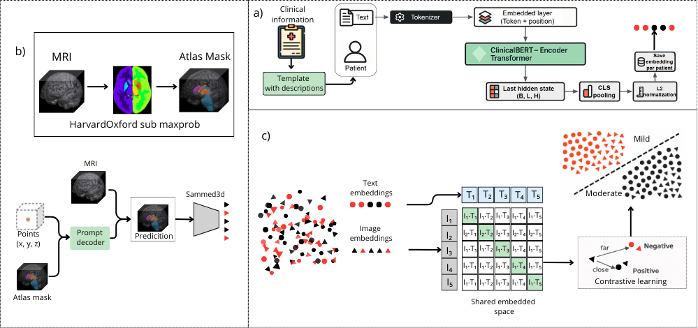

# multimodal-parkinson-classification-based-on-a-clip-like-model
This is the repository of a researching called: Supporting diagnostic classification of Parkinson’s disease through radiological findings and clinical assessment using a large-scale learning model

##🔨 Usage
This work is made of three parts:
  #1. 
